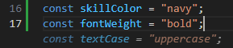

## Unit 1: Commit your local code to Github

I hit my first roadblock on the final step of [Commit your local code to GitHub](https://docs.astro.build/en/tutorial/1-setup/4/). When I tried to commit, I got an error: "Repository already exists."
    
Thank you to [Late Developer](https://www.youtube.com/@latedeveloper7836) for recording [the solution](https://www.youtube.com/watch?v=6WWf-iem3oA) a year ago.

## Unit 2: Use your first CSS variable

I have Github Copilot installed on VS Code, and I found it interesting that it offered to auto-complete the "Try it yourself" exercise.  I've been ignoring most of the auto-completion prompts so far, which have generally been giving generic suggestions with clearly AI generated text.  This time it suggested the exact font weight & text case. This was something I was supposed to enter myself, building on knowledge from a previous exercise to prove that I understood the syntax.

I'm curious if there were hints in the way I was building earlier, if GC is familiar with the tutorial, or if it's just pulling from the likely thousands of other public repos with the exact same info.  

Taken to extremes, I could imagine future software developers going through tutorials and having AI predicting all the code they're about to write. So far I'm just going to ignore the AI predictive stuff, but if it gets annoying or seems to be impacting learning, I might need to turn it off.

## Unit 3: Components

I wonder why we put the hamburger script tag below the footer, instead of simply putting it IN the footer.  Hopefully that's in a future exercise.

## Unit 4: Layouts

Aha. First exercise answered my question from the last module. The script gets re-used by creating a Layout.

## Unit 5: Astro API

I'm getting <b>TypeError: An error occurred. Cannot read properties of undefined (reading 'includes')</b> when I try to visit my tags after completing the Advanced Javascript section. It appears to me that I am not properly retrieving my blogpost tags, and I'm not sure if the tutorial is wrong/outdated or if I just did something wrong.  

One difference is that I have that Blogposts.astro component, because I misread an earlier challenge exercise. I'm going to remove that.

That didn't help, but I did notice that one post, learning-astro.md, had no tags. The first step in the advanced lab said "Check that all your blog posts contain tags" and apparently I missed that one.  Apparently the way we're calling these, if there are any blog posts without any tags, it will throw an error.

getStaticPaths() seems important, so I'm going to pause to read <a href="https://docs.astro.build/en/reference/routing-reference/#getstaticpaths">the documentation</a>.

